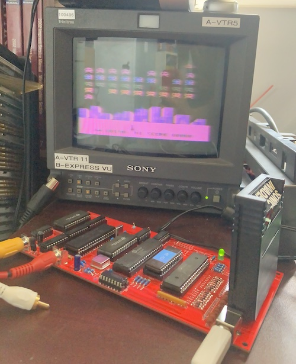

# Introduction
TODO

# Current Status

After bodging, version 0.1 of the Derivavision runs a game of _Sonic Invaders_, but a controller interface has not yet been developed. No other cartridges have been tested.

# Thank You
 - [Creativision Datasette Interface](http://www.8bit-homecomputermuseum.at/repair/creativision_datasette_interface/Creativision_datasette_interface.html) for clearing up the mystery of J3
 - Scouter3d for [keyboard and joystick mappings](http://www.madrigaldesign.it/forum/viewtopic.php?t=354)

# Other Libraries
 - [6502-kicad-library](https://github.com/Alarm-Siren/6502-kicad-library): 6502A CPU symbol
 - [CreativisionMegaCartV2](https://github.com/cheshirenoir/CreativisionMegaCartV2) for help with the cartridge edge
